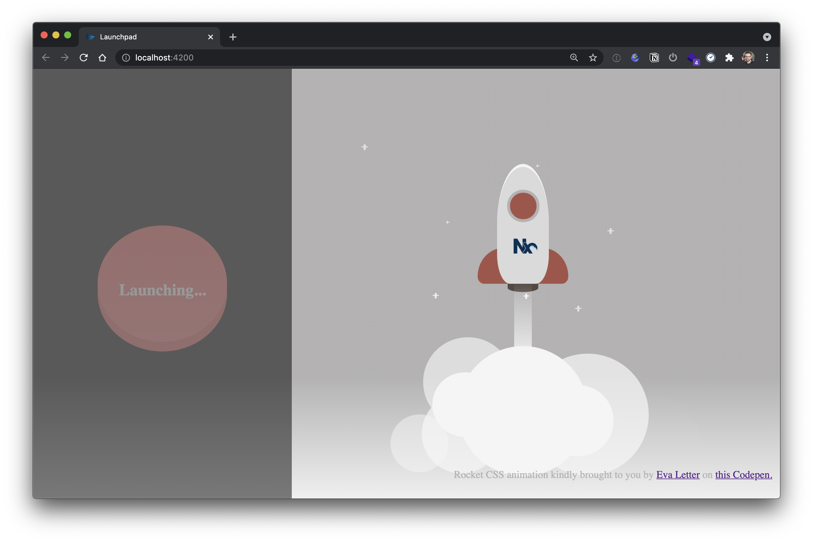

# Interstellar

This is a small demo app showcasing [Nx](https://nx.dev) + React + Storybook.



## Tour and Remarks

The monorepo basically consists of a `launch-pad` React application and 3 libraries:

- `control-panel`: basically contains the launch button for the Rocket
- `rocket`: the actual rocket UI
- `interstellar-styles`: the common styles referenced via the `stylePreprocessorOptions` options in the `workspace.json`. This "lib" serves as the place where to have the workspace common styles.

The libraries are generated via the Nx generator for React libraries:

```
$ yarn nx g @nrwl/react:lib ...
```

Storybook support can be added to libraries by first installing `@nrwl/storybook` and then generating storybook config for the given project. For example:

```
$ yarn nx g @nrwl/react:storybook-configuration rocket
```

The above comand adds Storybook support to the `rocket` library with options to automatically generate Stories as well. Note, stories can also be generated at a later point by using the `stories` generator (recommended way to discover these generators is to use the VSCode Nx Console).

The interesting part of Nx is how it integrates in this case React + Storybook + Cypress, and makes the configuration as seamless as possible.

**For the video** - don't put too much emphasis on the actual configuration of storybook (e.g. the content in `main.js` and `webpack.config.js`). Those are about to change soon and getting simplified a lot.

## Setup & Running the project

Clone the repo and run `yarn` to install the dependencies.

### Launching the App

Just use `yarn start` to run the app. Alternative to use the full command use `yarn nx serve launchpad`

### Launching Storybook

There are two Nx libraries, both of them have Storybook set up. Here's how to run the storybook for each of them.

The command to launch Storybook with Nx is

```
$ yarn nx storybook <project-name>
$ yarn nx run <project-name>:storybook
```

Both ways work. So for this repo that'd would be:

```
$ yarn nx storybook rocket
$ yarn nx storybook control-panel
```

### Running Cypress e2e tests for Storybook

Nx can automatically setup Cypress to test your Storybook stories.
The generic command to run Cypress tests is

```
$ yarn nx run <project-name>-e2e:e2e
```

In this specific repo there are Cypress e2e tests for both, the `control-panel` library as well as `rocket` library. They are both grouped under the `apps/storybook-e2e/...` folder.

Thus running them can be done like:

```
$ yarn nx e2e storybook-e2e-control-panel-e2e
$ yarn nx e2e storybook-e2e-rocket-e2e
```

> Note: the automatically generated `launchpad-e2e` can be ignored.
